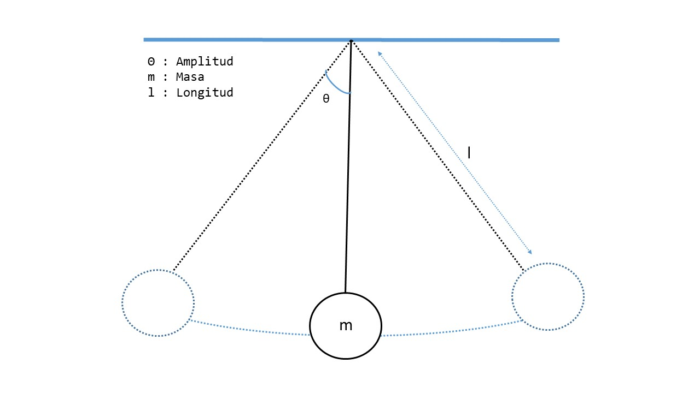

# La observación
Hacemos oscilar un péndulo y observamos el movimiento que describe. 

Nuestro objetivo es tratar de descubrir las variables de las que depende este movimiento y determinar aquellos factores que influyen en el y que hacen que este cambie. 

Observamos que:
- En la `posición de reposo` el péndulo no se mueve y permanece en su posición vertical. Todo su `peso` es soportado por la `tensión` del hilo.

- Cuando desplazamos el péndulo lateralmente, este describe un movimiento en un arco de circunferencia de radio igual a la `longitud` del hilo $$l$$ y de `amplitud` igual al dos veces el ángulo $$\theta$$.

- Una vez en movimiento, el péndulo va realizando oscilaciones cada vez de menor `amplitud` hasta que al final se detiene en su `posición de reposo`.

De estas observaciones en principio podemos pensar que el movimiento puede depender de las siguientes variables:
- `Peso`: Su valor es: $$P = m g$$ donde 
    - $$m$$: es la `masa` del objeto que oscila 
    - $$g$$: es la `aceleración de la gravedad`.
- `Radio`: Es la longitud $$l$$ del hilo.
- `Amplitud`: Es el ángulo $$\theta$$ donde el objeto cambia de sentido en cada oscilación

Con estas observaciones, podemos realizarnos, por ejemplo, las siguientes preguntas:
- ¿Por que se detiene el péndulo?
> En realidad no debería por lo que debe haber pérdidas de energía probablemente debidas a la fricción del hilo en su punto de unión y fuerzas de rozamiento con el aire dependiendo del coeficiente aeródinámico del objeto. Estas pérdidas de energia generarán calor y provocan que el péndulo poco a poco vuelva a su posición de reposo.

- ¿Cuánto tiempo dura cada oscilación?
> Esta es la pregunta a la que vamos a dedicar este estudio y llamaremos `periodo` a la `variable dependiente` que vamos a analizar.

**Periodo de un Péndulo Simple**: Tiempo que tarda en realizar un oscilación completa, es decir, en ir y venir.

A partir de estas observaciones y de la pregunta que nos hemos hecho, en la siguiente fase del método científico, formularemos las `hipótesis` que nos permitan explicar el fenómeno observado. 

En nuetro caso vamos a tratar de determinar el tiempo que el péndulo tarda en oscilar ida y vuelta (`Periodo`), `variable dependiente` a partir de las `variables independientes` que hemos identificado ($$m$$, $$g$$, $$l$$, $$\theta$$)

[Volver](..)